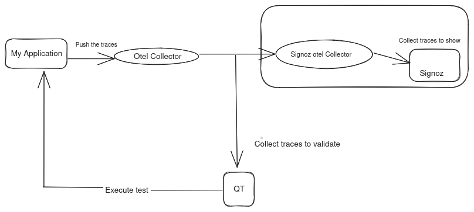

# Quality Trace
Quality Trace is a trace-based testing tool for building integration and end-to-end tests in minutes using your OpenTelemetry traces. Assert against your trace data at every point of a request transaction.

## Table of Contents
- [How does QT works?](#How--does-QT-works?)
- [Architecture diagram](#architecture-diagram)
- [How to install and run Quality Trace?](#how-to-install-and-run-Quality-Trace?)
- [What does the test definition file look like?](#what-does-the-test-definition-file-look-like)
- [How to run an automated test?](#how-to-run-an-automated-test?)

##  How does QT works?
Build integration and end-to-end tests in minutes, instead of days, using OpenTelemetry and trace-based testing.

1. Pick an endpoint to test.
2. Run a test, and get the trace.
3. The trace is the blueprint of your system under test. It shows all the steps the system has taken to execute the request.
4. Add assertions on different services, checking return statuses, data, or even execution times of a system.
5. Run the tests.

Once the test is built, it can be run automatically as part of a build process. Every test has a trace attached, allowing you to immediately see what worked, and what did not, reducing the need to reproduce the problem to see the underlying issue.We can able to see the traces in signoz ui.

## Architecture diagram



## How to install and run Quality Trace?

#### Prerequisites
* A Kubernetes cluster 
* Helm binary
* Application instrumented by open telemetry

#### Prepare Namespace

This command will create a new **namespace** for your cluster.

```bash
kubectl create namespace quality-trace
```

`
### Install the Quality Trace CLI
Download the cli from quality-trace repository according to the operating system.
Use this command for Unix-like operating systems (including Linux and macOS)  to change the permissions of a file and make it executable.

```bash
chmod +x your-executable-file
```

### Install the Quality Trace Server

` 

Install QT with Helm. The QT Helm charts are located 

```bash
helm repo add quality-trace https://intelops.github.io/quality-trace
helm repo update 

helm install quality-trace quality-trace/quality-trace
```

### How to configure the server url

```bash
quality-trace configure
```
Enter the server url: [Please enter the server url]

<p align="center">
  Qualitytrace lets you build integration and end-to-end tests 98% faster with distributed traces.
</p>

<p align="center">
  No plumbing, no mocks, no fakes. Test against real data.
</p>

**Build tests in minutes**

We should use yaml file for testing the http and grpc applications from the cli.
## What does the test definition file look like?

The Quality Trace [test definition files] are written in a simple YAML format. You can write them directly. Here is an example of a test which:

- Executes `POST` against the endpoint.
- Verifies that the HTTP blocks return a `201` status code.

```yaml
type: Test
spec:
id: tA_Of67IR
name: name of the application
trigger:
type: http
httpRequest:
method: Method you need to test like GET,POST etc
url: [Endpoint of your application]
body: [body {"The request body of your application"}]
headers:
- key: Content-Type
value: application/json
specs:
- selector: span[Qualitytrace.span.type="http"]
name: "All HTTP Spans: Status code is 201"
assertions:
- attr:http.status_code = 201
```

Save a test definition file for http application. Use the CLI to run a test.

For grpc applications please add the protobuf file in the definition file.

```yaml
type: Test
spec:
  id: xZIRCuIIZ
  name: name of the application
  trigger:
    type: grpc
    grpc:
      protobufFile: |
       [your application protobuf file]
address: Endpoint to your appplicaion
method: [Method you need to test]
request: [The request body of your application]
auth: {}
```

## How to run an automated test?

```bash
quality-trace run test --file /path/to/name.yaml
```

You can:

- **Assert** against both the **response and trace data** at every point of a request transaction.
- **Assert** on the **timing of trace spans**.
  - Eg. A database span executes within `100ms`.
- **Wildcard assertions** across common types of activities.
  - Eg. All gRPC return codes should be `0`.
  - Eg. All database calls should happen in less than `100ms`.
- **Assert** against **side-effects** in your distributed system.
  - Eg. Message queues, async API calls, external APIs, etc.
- **Integrate** with your **existing distributed tracing solution**.
- Define multiple test triggers:
  - HTTP requests
  - gRPC requests
  - Trace IDs
  - and many more...
- Save and run tests manually.
- Verify and analyze the quality of your OpenTelemetry instrumentation to enforce rules and standards.
- Test long-running processes.