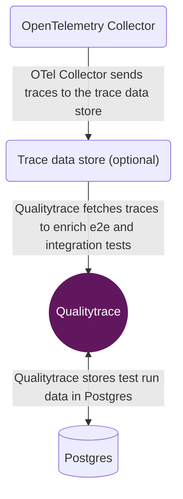

# Deployment

This section contains a general overview of deploying Qualitytrace in production. You can find platform-specific guides for:

- [Docker](./docker)
- [Kubernetes](./kubernetes)

As shown in the diagram below, a typical production Qualitytrace deployment consists of Postgres, an OpenTelemetry Colletor and a [trace data store](../configuration/overview). But, if you do not want to use a trace data store, you can rely entirely on OpenTelemetry Collector.

<!-- Add graph for Qualitytrace cluster -->



Postgres stores all Qualitytrace-related data.

OpenTelemetry Collector ingests traces from your distributed system and forwards them to a trace data store.

A trace data store is used to store traces. Qualitytrace will fetch trace data from the trace data store when running tests.

Qualitytrace can be configured via a configuration file:

```yaml
# quality-trace.yaml

postgres:
  host: postgres
  user: postgres
  password: postgres
  port: 5432
  dbname: postgres
  params: sslmode=disable
```

Read more in the [configuration docs](../configuration/overview.md).

Or, continue reading to see how to run Qualitytrace in production with [Docker](./docker) or [Kubernetes](./kubernetes).
