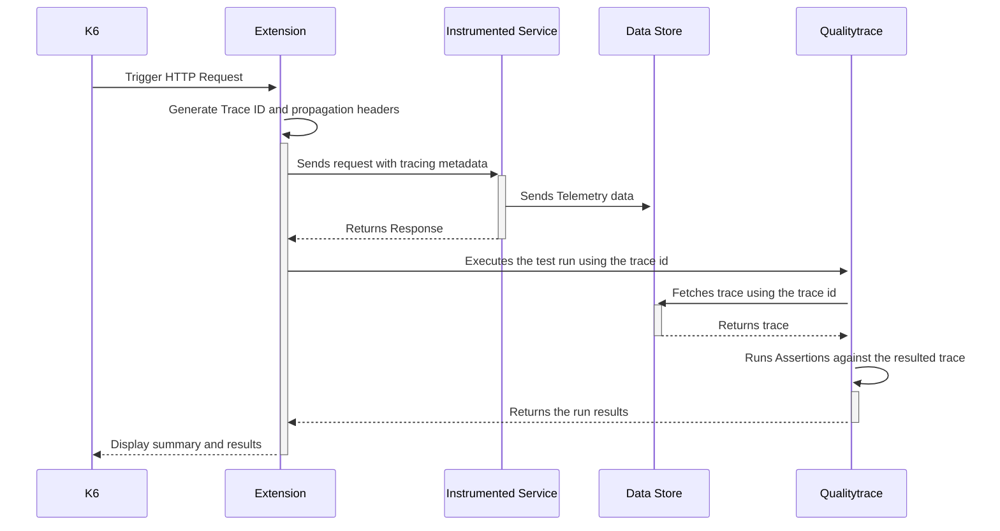

# Running Qualitytrace with K6

[Qualitytrace]<!--(https://tracetest.io/) -->is a testing tool based on [OpenTelemetry](https://opentelemetry.io/) that allows you to test your distributed application. It allows you to use data from distributed traces generated by OpenTelemetry to validate and assert if your application has the desired behavior defined by your test definitions.

[K6](https://k6.io/) is a powerful tool to run load tests against any type of services (REST, GRPC, GraphQL, etc). It is widely used by Developers, Site Reliability Engineers and Software Engineers in Test / QA teams to find potential issues when testing real life scenarios in both controlled environments and production.

## Why is this important?

K6 is it's a great tool in its own right that allows you to replicate most of the production challenges you might encounter. But, as with all of the tools that only test the initial transaction between the client side and the server, you can only run validations against the immediate response from the service.

<div style={{position: "relative", paddingBottom: "62.5%", height: "0"}}>
  <iframe src="https://www.loom.com/embed/5c5e1261bb0b4fefa30081294378908c" frameborder="0" webkitallowfullscreen mozallowfullscreen allowfullscreen width="100%" style={{position: "absolute", top: "0", left: "0", width: "100%", height: "100%"}}>
  </iframe>
</div>

## The K6 Qualitytrace Extension

With the [K6 Qualitytrace extension]<!--(https://github.com/kubeshop/xk6-tracetest)-->, you will unlock the power of OpenTelemetry that allows you to run deeper testing based on the traces and spans generated by each of the checkpoints that you define within your services.

Language and Vendor agnostic, with this extension you can use your existing Tracing Data Store and Setup to leverage the work you have already done to instrument your services.

## How It Works

The following is high level sequence diagram on how K6 and Qualitytrace interact with the different pieces of the system.



## Requirements

**Qualitytrace Server:** You'll ned to have a running instance of Qualitytrace which is going to be executing your tests and assertions.

To do so, you can follow the instructions defined in the [documentation](../getting-started/installation.mdx).

**XK6:** To start using the Qualitytrace k6 binary you need to have the xk6 builder installed on your machine.
You can follow the instructions defined in this [page](https://github.com/grafana/xk6/) to do that.

**OpenTelemetry Instrumented Service:** In order to generate traces and spans, the  service under test must support the basics for [propagation](https://opentelemetry.io/docs/reference/specification/context/api-propagators/) through HTTP requests as well as store traces and spans into a Data Store Backend (Jaeger, Grafana Tempo, OpenSearch, etc).

## Installing the K6 Qualitytrace Extension

Installing the K6 Qualitytrace extension is as easy as running the following command:

```bash
xk6 build v0.42.0 --with github.com/kubeshop/xk6-quality-trace
```

The instructions can be also found in the main [k6 docs](https://k6.io/docs/extensions/get-started/bundle/) in case you need to combine multiple extensions into one binary.

## Using the Qualitytrace Extension For Load Tests

Once you have installed the k6 Qualitytrace binary, you can use the base k6 functionality to run load tests against instrumented services and Qualitytrace to run checks against the resulting telemetry data.

### Creating your Qualitytrace Test

The first step is to create the test that will be used to run the telemetry data validations. In this step, we will create the assertions that will be executed for each of the runs.

To do so, you can either use the UI or the CLI.

**UI:**

1. Click the Create button from the Qualitytrace homepage <!-- (https://demo.tracetest.io/)-->.
2. Select `TraceID` as the trigger mode.
3. Enter the basic details.
4. Choose the name of the variable you'll be using for the trace id (e.g. TRACE_ID).
5. Create and run the test with a random value.

**CLI:**

If you have the CLI configured, you can save the following test definition to a local `.yaml` file.

```yaml
type: Test
spec:
  id: kc_MgKoVR
  name: K6
  description: K6
  trigger:
    type: traceid
    traceid:
      id: ${var:TRACE_ID}
```

And create the test using the following command:

```bash
quality-trace run test -f <name-of-the-file>
```

### Extension Features

The extension includes a new package which includes classes for HTTP requests and the main Qualitytrace instance.

This can be imported as follows:

```javascript
import { Http, Qualitytrace } from "k6/x/quality-trace";
```

**The HTTP Class:**
The HTTP class is the primary entry point to execute requests. It extends the default `http` interface by generating parent trace ids and sending them as part of the propagation headers to the request.

To create an HTTP instance and use it, you can follow the next code sample.

```javascript
// Qualitytrace test identifier
const testId = "<your-test-id>;

// creating the main http instance
const http = new Http();

// adding configuration whe creating the instance
const http = new Http({
  // supported propagators tracecontext, baggage, b3, ot, jaeger & xray
  propagators: ['b3'],

  // quality-trace configuration 
  quality-trace: {
    // define the triggered test id
    testId,
    // used variable name to inject the trace id to the test
    variableName: 'TRACE_ID',
  },
});

const url = "http://localhost:8081/pokemon/import";
const pokemonId = 6; // charizad
const payload = JSON.stringify({
    id: pokemonId,
  });

// using the http instance to trigger requests
const response = http.post(url, payload, const params = {
  headers: {
    "Content-Type": "application/json",
  },
};);

// overwriting the instance level config per request
const response = http.post(url, payload, {
  // same as the http instance config
  quality-trace: {
    testId,
  },
  // rest of the regular http options
  headers: {
    "Content-Type": "application/json",
  },
});


// direct access to the trace id from the response object
console.log(response.trace_id)
```

**The Qualitytrace Class:**
The Qualitytrace class is the main breach between the k6 load tests and the Qualitytrace API, used to run the tests, validate the results and generate the summary response.

To create a Qualitytrace instance and use it you can follow the next code sample.

```javascript
const quality-trace = Qualitytrace();

// adding your quality-trace server configuration
const quality-trace = Qualitytrace({
  serverUrl: "http://localhost:11633",
  serverPath: "",
});

// generating the summary
export function handleSummary(data) {
  // combine the default summary with the quality-trace summary
  const qualitytraceSummary = quality-trace.summary();
  const defaultSummary = textSummary(data);
  const summary = `
    ${defaultSummary}
    ${qualitytraceSummary}
  `;

  return {
    stdout: summary,
    // JSON summary object for CI/CD proposes
    "quality-trace.json": quality-trace.json(),
  };
}

// enable this to return a non-zero status code if a quality-trace test fails
export function teardown() {
  // returns a non-zero code when any of the quality-trace test fails
  quality-trace.validateResult();
}

const metadata = {
  id: "123",
  url,
  method: "GET",
};

// manually running a test
quality-trace.runTest(response.trace_id, { testId }, metadata);
```

### Using the Custom Output

The Qualitytrace K6 extension includes an output you can use to automatically trigger the test using the predefined configuration.
In this case, you can avoid manually using:

```javascript
quality-trace.runTest(response.trace_id, { testId }, metadata);
```

And just focus on writing the HTTP triggers.
To use this feature, you can use the following command:

```bash
k6 run <your-script>.js -o xk6-quality-trace
```

### Result Summary

The Javascript extension includes a feature that you can use to display the results from the Qualitytrace test runs execution.

You can add it to your script using the following:

```javascript
// generating the summary
export function handleSummary(data) {
  // combine the default summary with the quality-trace summary
  const qualitytraceSummary = quality-trace.summary();
  const defaultSummary = textSummary(data);
  const summary = `
    ${defaultSummary}
    ${qualitytraceSummary}
  `;

  return {
    stdout: summary,
    // JSON summary object for CI/CD proposes
    "quality-trace.json": quality-trace.json(),
  };
}
```

This will generate an output like the following:

```bash

          /\      |‾‾| /‾‾/   /‾‾/   
     /\  /  \     |  |/  /   /  /    
    /  \/    \    |     (   /   ‾‾\  
   /          \   |  |\  \ |  (‾)  | 
  / __________ \  |__| \__\ \_____/ .io

  execution: local
     script: quality-trace/examples/quality-trace-k6/import-pokemon.js
     output: xk6-quality-trace-output (TestRunID: 93008)

  scenarios: (100.00%) 1 scenario, 1 max VUs, 36s max duration (incl. graceful stop):
           * default: 1 looping VUs for 6s (gracefulStop: 30s)

ERRO[0017] panic: Qualitytrace: 5 jobs failed

Goja stack:
native 

running (17.1s), 0/1 VUs, 6 complete and 0 interrupted iterations
default ✓ [======================================] 1 VUs  6s

         ✓ is status 200
     ✓ body matches de id

     █ teardown

     checks.........................: 100.00% ✓ 12       ✗ 0  
     data_received..................: 1.1 kB  67 B/s
     data_sent......................: 3.3 kB  190 B/s
     http_req_blocked...............: avg=89µs    min=3µs    med=12.5µs max=476µs  p(90)=249µs  p(95)=362.49µs
     http_req_connecting............: avg=37µs    min=0s     med=0s     max=222µs  p(90)=111µs  p(95)=166.49µs
     http_req_duration..............: avg=4.83ms  min=1.86ms med=5.35ms max=7.61ms p(90)=6.77ms p(95)=7.19ms  
       { expected_response:true }...: avg=4.83ms  min=1.86ms med=5.35ms max=7.61ms p(90)=6.77ms p(95)=7.19ms  
     http_req_failed................: 0.00%   ✓ 0        ✗ 6  
     http_req_receiving.............: avg=51µs    min=32µs   med=52.5µs max=74µs   p(90)=68µs   p(95)=71µs    
     http_req_sending...............: avg=47.83µs min=17µs   med=47µs   max=88µs   p(90)=71µs   p(95)=79.49µs 
     http_req_tls_handshaking.......: avg=0s      min=0s     med=0s     max=0s     p(90)=0s     p(95)=0s      
     http_req_waiting...............: avg=4.74ms  min=1.75ms med=5.23ms max=7.56ms p(90)=6.69ms p(95)=7.12ms  
     http_reqs......................: 6       0.350387/s
     iteration_duration.............: avg=2.44s   min=1s     med=1s     max=11.08s p(90)=5.03s  p(95)=8.06s   
     iterations.....................: 6       0.350387/s
     vus............................: 0       min=0      max=1
     vus_max........................: 1       min=1      max=1
    [TotalRuns=6, SuccessfulRus=1, FailedRuns=5] 
[FAILED] 
[Request=POST - http://localhost:8081/pokemon/import, TraceID=dc071893eaaca9de301f2147e2be372e, RunState=FINISHED FailingSpecs=true, QualitytraceURL= http://localhost:3000/test/kc_MgKoVR/run/272] 
[Request=POST - http://localhost:8081/pokemon/import, TraceID=dc0718fff1aca9de30b702c3a1bfad75, RunState=FINISHED FailingSpecs=true, QualitytraceURL= http://localhost:3000/test/kc_MgKoVR/run/275] 
[Request=POST - http://localhost:8081/pokemon/import, TraceID=dc0718b8daaca9de301e39889afca15b, RunState=FINISHED FailingSpecs=true, QualitytraceURL= http://localhost:3000/test/kc_MgKoVR/run/276] 
[Request=POST - http://localhost:8081/pokemon/import, TraceID=dc0718a7e2aca9de30955b5203b162a7, RunState=FINISHED FailingSpecs=true, QualitytraceRL= http://localhost:3000/test/kc_MgKoVR/run/273] 
[Request=POST - http://localhost:8081/pokemon/import, TraceID=dc0718edf9aca9de305916d7b1e7814c, RunState=FINISHED FailingSpecs=true, QualitytraceURL= http://localhost:3000/test/kc_MgKoVR/run/274] 
[SUCCESSFUL] 
[Request=POST - http://localhost:8081/pokemon/import, TraceID=dc0718c9d2aca9de3044a794f7248eab, RunState=FINISHED FailingSpecs=false, QualitytraceURL= http://localhost:3000/test/kc_MgKoVR/run/271]
```

This identifies the test that failed and the status and links to look at the results directly from the UI.

### Non-Zero Status

An important use case is to integrate the extension with your CI/CD tools. In this case, the Qualitytrace class allows you to validate the results during the k6 `teardown` lifecycle event which returns a failed status if any of the test run fails. A failed test can be defined as:

- The trace could not be fetched from the data store.
- Any of the test specs failed.
- Could not connect to the Qualitytrace API.
- An execution error from the Qualitytrace Server side.

To enable this, you can simply add the following to your test script:

```javascript
// enable this to return a non-zero status code if a quality-trace test fails
export function teardown() {
  quality-trace.validateResult();
}
```

### Configuration and Environment Variables

If you want to reuse your test scripts for multiple environments and to avoid hardcoding values like the server URL and/or path, use the following configuration variables to achieve this:

**XK6_QUALITYTRACE_SERVER_URL:** Allows you to set the server url for the entire test script.

Usage:

```bash
XK6_QUALITYTRACE_SERVER_URL=<your-server-url> k6 run <your-script>.js -o xk6-quality-trace
```

You can also define the global server url by passing it as an output parameter:

```bash
k6 run <your-script>.js -o xk6-quality-trace=<your-server-url>
```

**XK6_QUALITYTRACE_SERVER_PATH:** Allows you to set the server path for the entire test script.

Usage:

```bash
XK6_QUALITYTRACE_SERVER_PATH=<your-server-path> k6 run <your-script>.js -o xk6-quality-trace
```

Need more ways to configure it? Let us know!

## Full Script Example

The following is a full script example using the k6 Qualitytrace extension:

```javascript
import { check } from "k6";
import { textSummary } from "https://jslib.k6.io/k6-summary/0.0.2/index.js";
import { Http, Qualitytrace } from "k6/x/quality-trace";
import { sleep } from "k6";

export const options = {
  vus: 1,
  duration: "6s",
};

const quality-trace = Qualitytrace({
  serverUrl: "http://localhost:11633",
});
const testId = "kc_MgKoVR";
let pokemonId = 6; // charizad
const http = new Http();
const url = "http://localhost:8081/pokemon/import";

export default function () {
  const payload = JSON.stringify({
    id: pokemonId,
  });
  const params = {
    quality-trace: {
      testId,
    },
    headers: {
      "Content-Type": "application/json",
    },
  };

  const response = http.post(url, payload, params);

  check(response, {
    "is status 200": (r) => r.status === 200,
    "body matches de id": (r) => JSON.parse(r.body).id === pokemonId,
  });

  pokemonId = pokemonId + 1;
  sleep(1);
}

// enable this to return a non-zero status code if a quality-trace test fails
export function teardown() {
  quality-trace.validateResult();
}

export function handleSummary(data) {
  // combine the default summary with the quality-trace summary
  const qualitytraceSummary = quality-trace.summary();
  const defaultSummary = textSummary(data);
  const summary = `
    ${defaultSummary}
    ${qualitytraceSummary}
  `;

  return {
    stdout: summary,
    "quality-trace.json": quality-trace.json(),
  };
}
```

## Get Started

If you want to learn more or try a full setup using k6 and Qualitytrace you can head out to this `quality-trace-k6` get-started [example](https://github.com/intelops/quality-trace/tree/main/examples/quality-trace-k6) we have prepared.
It is a step-by-step guide using Docker and our Pokemon demo app that showcases the power of combining k6 and Qualitytrace.
